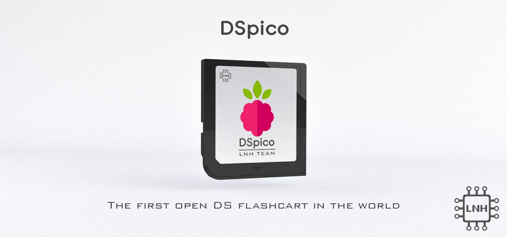

# DSpico Hardware
## 🗺️ Contents
- [ℹ Introduction](#ℹ-introduction)
- [❔ About this repository](#-about-this-repository).
- [🎮 DSpico PCB](#-dspico-pcb)
- [🧰 DSpico Shell](#-dspico-shell)
- [🎨 Artwork: Stickers and box art](#-artwork-stickers-and-box-art)
- [📦 Instructions](#-instructions)
- [🛠 Development](#-development)
- [👥 Contributions](#-contributions)
- [👾 Discord](#-discord)
- [📋 LNH Team Statement](#-lnh-team-statement)
- [⚖ License](#-license)

## ℹ Introduction
### What is DSpico?
DSpico is the world's first open-source DS(i) flashcart, created by the LNH team. Everything from the PCB, shell, stickers, and box art is open-source. You can either build it yourself as a DIY project or have it made by a manufacturer.

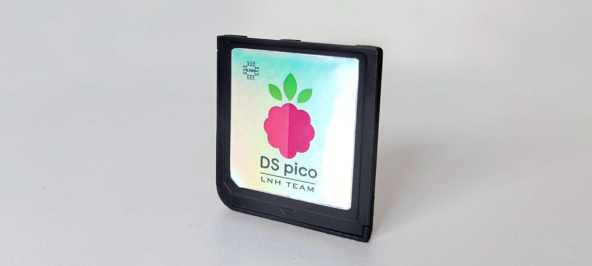

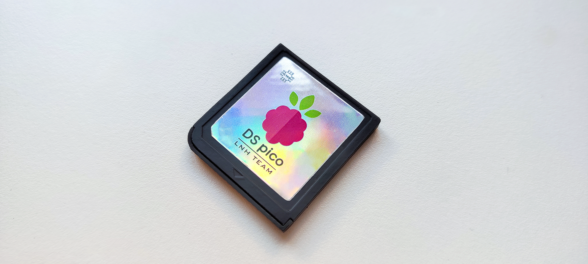

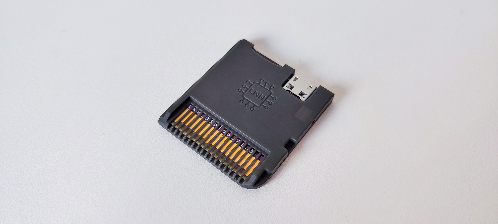

### Features
- RP2040 microcontroller
- 16 Mbit flash memory
- Micro USB port
- Micro SD slot
- Development port
- Two LEDs (red and blue)
- Dual power support: can be powered by USB and DS simultaneously (by ORing circuit)

With the [DSpico Firmware](https://github.com/LNH-team/dspico-firmware):
- Sequential SD read speed: up to 6MB/s
- Power consuption: ~57 mW
- Compatible with DSi mode
- Compatible with [Pico Loader](https://github.com/LNH-team/pico-loader) and [Pico Launcher](https://github.com/LNH-team/pico-launcher)

## ❔ About this repository
This repository contains the necessary files for the hardware of the DSpico, including a PCB, CAD design of the shell, stickers for cartridge and box art.

## 🎮 DSpico PCB
The PCB design is located in the [`dspico-pcb`](dspico-pcb) folder. This folder contains all the necessary files for PCB fabrication, as well as the design files created using the electronic design software Altium Designer.

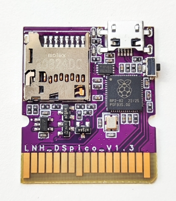
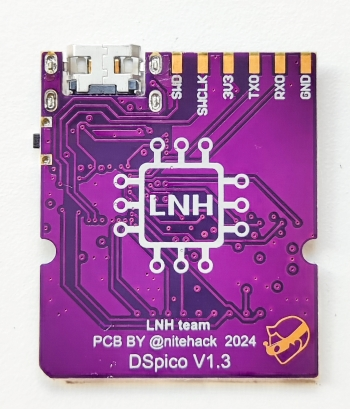
### 📂 Included Subfolders:
- [`design-files`](dspico-pcb/design-files): PCB schematic and layout of DSpico. (Altium format)
- [`fabrication-files`](dspico-pcb/fabrication-files): Gerber files, Pick&Place files and BOM for PCB fabrication of DSpico.
- [`docs`](dspico-pcb/docs): Documentation for manufacturing and assembling DSpico.

### 🔌 Pinout

| **Peripheral**  | **Pin name - Peripheral** | **Pin name - RP2040** | **Pin number - RP2040** |
|-------------|-----------------------|-------------------|-------------|
| **DS Slot** | D0                    | GPIO12            | 15          |
|             | D1                    | GPIO13            | 16          |
|             | D2                    | GPIO14            | 17          |
|             | D3                    | GPIO15            | 18          |
|             | D4                    | GPIO16            | 27          |
|             | D5                    | GPIO17            | 28          |
|             | D6                    | GPIO18            | 29          |
|             | D7                    | GPIO19            | 30          |
|             | CLK_DS                | GPIO11            | 14          |
|             | ROM_CS                | GPIO10            | 13          |
|             | SPI_CS                | GPIO21            | 32          |
|             | IRQ                   | GPIO20            | 31          |
|             | RST_DS                | GPIO09            | 12          |
| **SD slot**| CLK_SD                | GPIO03            | 5           |
|             | DAT0                  | GPIO05            | 7           |
|             | DAT1                  | GPIO06            | 8           |
|             | DAT2                  | GPIO07            | 9           |
|             | DAT3                  | GPIO08            | 11          |
|             | CMD                   | GPIO04            | 6           |
| **DEV port**| SWD                   | SWD               | 25          |
|             | SWCLK                 | SWCLK             | 24          |
|             | TX                    | GPIO0            | 2           |
|             | RX                    | GPIO1            | 3           |
| **Blue LED**   | LED_B                 | GPIO28            | 40          |
| **Red LED**   | LED_R                 | GPIO27            | 39          |

## 🧰 DSpico Shell

The CAD design of the shell is located in the [`dspico-shell`](dspico-shell) folder. This folder contains 3D models of the shell (output 3d models and design files), which can be viewed and modified using CAD design software Autodesk Inventor

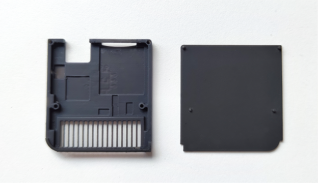
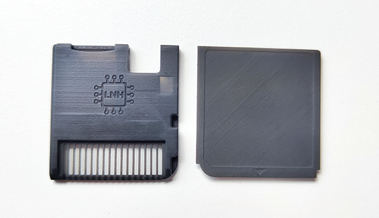
### 📂 Included Subfolders:
- [`design-files`](dspico-shell/design-files): Contains source design files for the shell
- [`3d-models`](dspico-shell/3d-models): Contains 3D models of the shell in STL and STEP format for fabrication.

## 🎨 Artwork: Stickers and box art
The stickers and box art design are located in the [`dspico-artwork-design`](dspico-artwork-design).  This folder contains stickers for cartridge and box art in SVG, PSD and PNG formats.

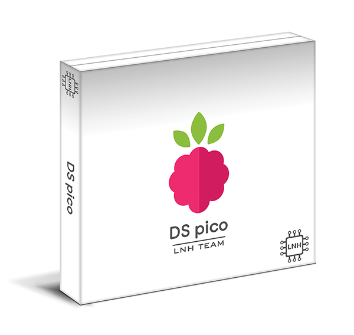
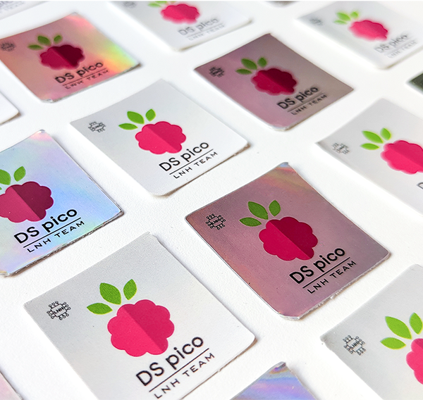

### 📂 Included Subfolders:
- [`stickers`](dspico-artwork-design/stickers): Stickers to print and put on your DSpico cartridge.
- [`box-art`](dspico-artwork-design/box-art): Box art design to print and put on your DS box.
- [`logo`](dspico-artwork-design/logo): DSpico logo in different formats.
- [`others`](dspico-artwork-design/others): Other graphics related to DSpico

## 📦 Instructions
### 1️⃣ Build
1. **Manufacture the PCB and Shell** 
    Start by producing both the PCB and the shell. Go to the respective sections, [`dspico-pcb`](dspico-pcb) and [`dspico-shell`](dspico-shell), and read the README file in each to understand how to create these parts.

2. **Optional: Customize with a Sticker and Box Art** 
    If desired, you can print a sticker from the stickers section and add box art [`dspico-artwork-design`](dspico-artwork-design) for storing your DSpico (for example, by reusing an existing box).

### 2️⃣ Assembly
Once you have both the PCB and the shell manufactured, the next step is to assemble them. Follow these steps:
1. First, insert the PCB into the bottom part of the shell.
2. Next, attach the top part of the shell by aligning the pegs with the holes in the bottom part.
3. Stick your favorite DSpico sticker on top part.
Make sure everything fits, and your DSpico will be ready for the next steps!

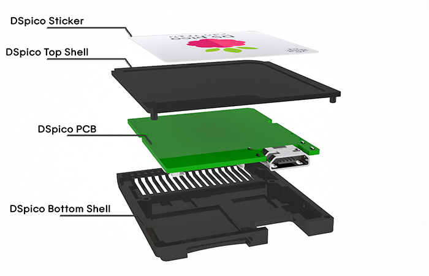
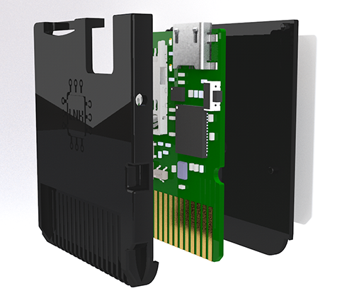

### 3️⃣ Setup the software
Follow the [guide](https://github.com/LNH-team/dspico/blob/develop/GUIDE.md) for instructions on how to compile and setup the firmware and the contents of the micro SD card.

## 🛠 Development
The DSpico features a development port for creating new applications and developing new peripherals. The available communication ports are as follows:
- UART
- I2C
- x2 GPIO
- SWD (debug)

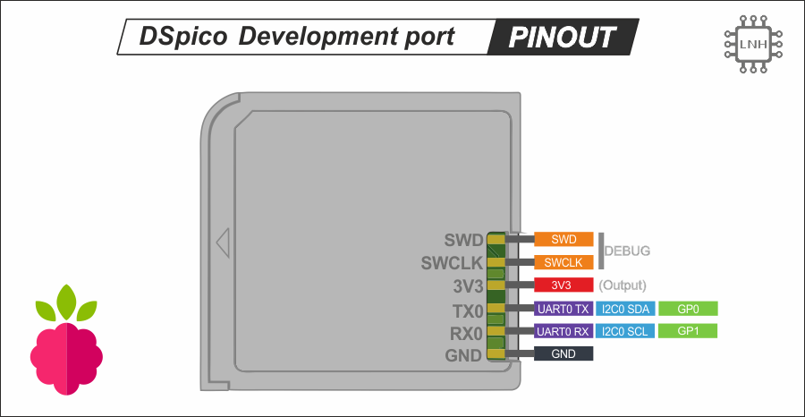

As for the power it can provide to peripherals, it is:
- 3.3 V (up to 50 mA)

The pitch between pins of this port is 2.54 mm such that some connectors can be soldered (as long as it does not interfere with the rest of the DSpico mechanics). For example a male or female header.

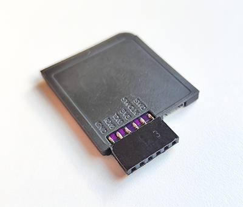
## 👥 Contributions

Contributions are welcome. If you wish to improve the PCB or shell designs, feel free to submit a pull request!

### Contributors:

#### PCB:
 - [nitehack](https://www.github.com/nitehack)
 - [Gericom](https://github.com/Gericom) (first DSpico prototype)

#### Shell:
 - rcuevas
 - [nitehack](https://www.github.com/nitehack)

#### Artworks:
 - [nitehack](https://www.github.com/nitehack)

## 👾 Discord
- [DS⁽ⁱ⁾ Mode Hacking!](https://discord.gg/fCzqcWteC4)

## 📋 LNH Team Statement
We wish to make it clear that the LNH team has no affiliation with any commercial projects, and we do not endorse or engage in any for-profit endeavors concerning DSpico or related materials. This statement serves as a formal disavowal of any financial or business dealings that may arise in relation to DSpico, and we take no responsibility for any actions or transactions carried out by third parties in this regard.

## ⚖ License

This project is licensed under the CC BY-SA 4.0 License. See the [`LICENSE`](LICENSE) file for more details.

