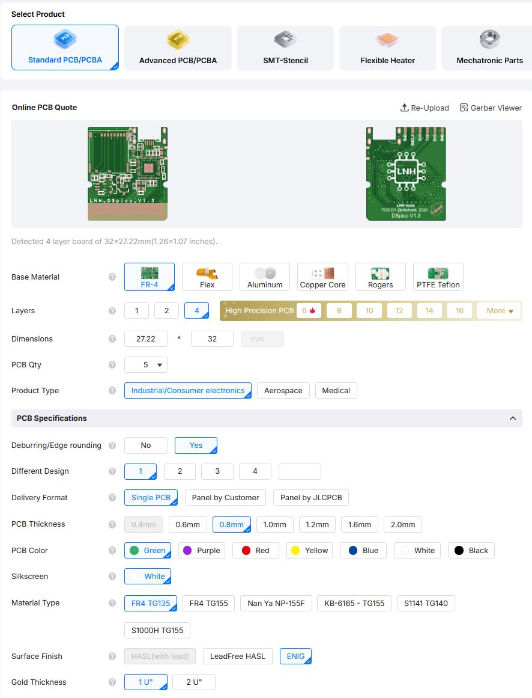
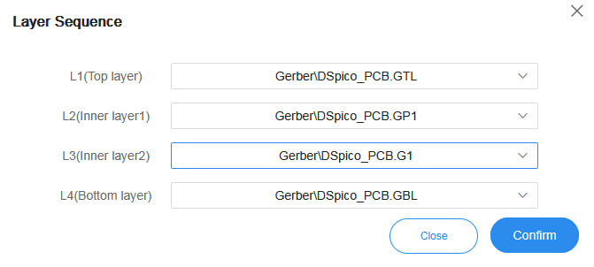
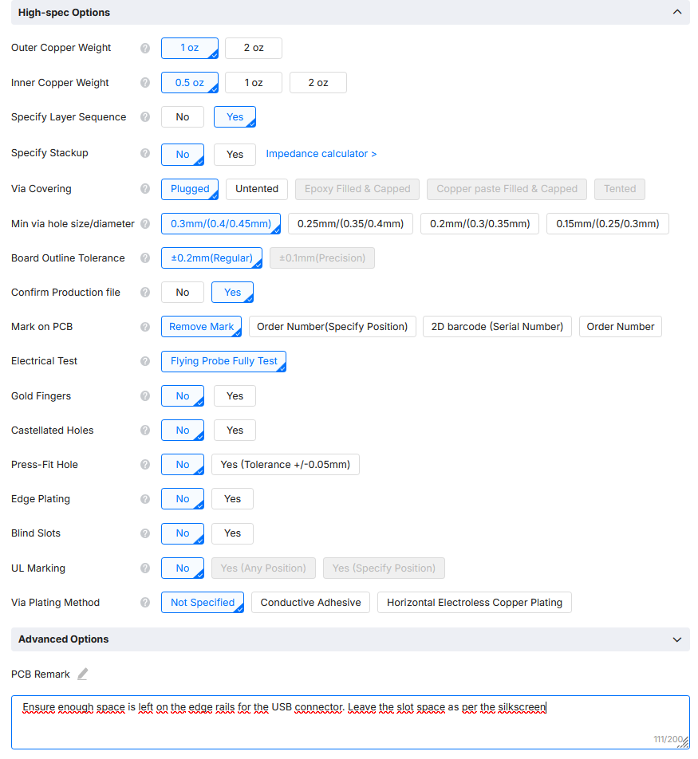
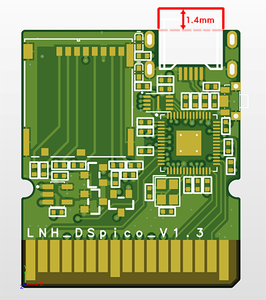
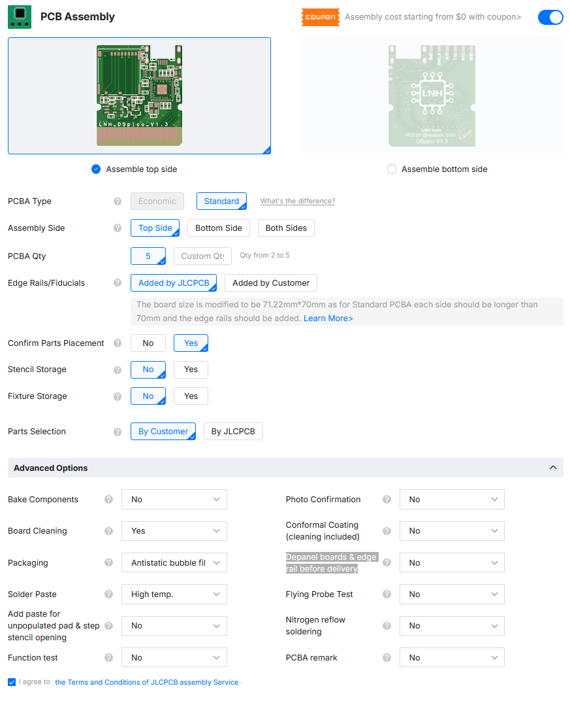
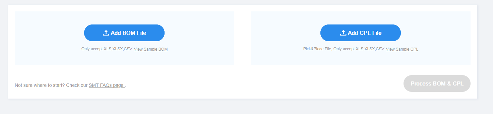
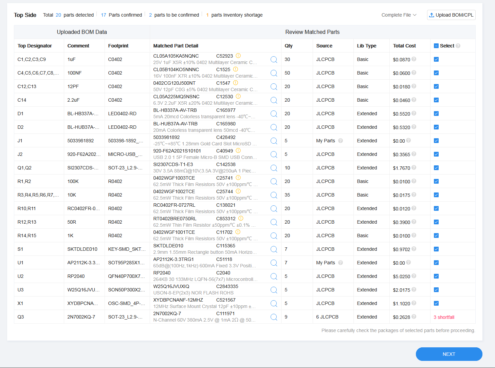
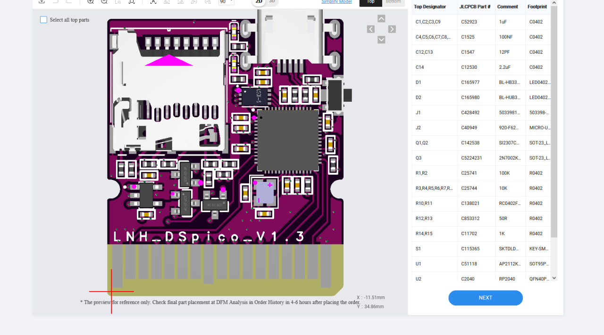

# DSpico PCB

This repository contains the files and configurations needed to fabricate and assemble the PCB for the **DSpico** flashcart. You can manufacture with the manufacturer you prefer. In this readme we include a guide on how to order it from [JLCPCB](https://cart.jlcpcb.com/quote?spm=Jlcpcb.Homepage.1006)

## 📂 Included Subfolders:
- [`design-files`](./design-files): PCB schematic and layout of DSpico. (KiCad format)
- [`fabrication-files`](./fabrication-files): Gerber files, Pick&Place files and BOM for PCB fabrication of DSpico.
   - 📂 `Gerber`: Gerber files required for fabrication.
   - 📂 `NC Drill`: Contains the NC Drill files required for PCB hole drilling.
   - 📂 `BOM`: Bill of Materials (BOM) for assembly.
   - 📂 `Pick Place`: Pick and Place files for component placement.
- [`docs`](./docs): Documentation for manufacturing and assembling DSpico. (including schematics)

---

## 📦 Guide to get a PCB

### 1. PCB Order- JLCPCB
> [!WARNING]
> This guide was last reviewed on **November 22, 2025**. 
> Please be aware that the manufacturer's website and production processes may have changed since this date. 

1. **Prepare files**
   - Make a compressed file ZIP of `NC Drill` and `Gerber` folder with the name of `Gerber.zip` (for example)
2. **Go to the Website of manufacturer**
  
   - Visit [JLCPCB PCB Quote](https://cart.jlcpcb.com/quote).

3. **Upload Gerber and NC Drill Files**:

   - Upload the `Gerber.zip` file to the JLCPCB configurator.

4. **PCB Configuration**
   

   - Base Material: **FR-4**
   - Number of Layers: **4 layers** (auto-detected after uploading Gerber files).
   - Dimensions: (auto-detected after uploading Gerber files).
   - Quantity: **5 units** (minimum)

>PCB Specifications
   - Deburring/Edge rounding: Yes
   - Different Design: 1
   - Delivery Format : Single PCB
   - PCB Thickness: **0.8mm** (very important)
   - PCB Color: (As you want but normally green is the cheapest)
   - Silkscreen: **White** 
   - Material Type: FR4 TG135
   - Surface Finish: **ENIG**
   - Gold Thickness: **1U"**. (Or more, but more expensive)

>High-spec Options
   - Outer Copper Weight: **1 oz**
   - Inner Copper weight: **0.5 oz**
   - Specify Layer Sequence: YES
      

   - Specify Stackup: **No**
   - Via Covering: **Plugged**
   - Min via hole size/diameter: **0.3mm (0.4/0.45mm)**
   - Board Outline Tolerance: **±0.2mm (Regular)**
   - Confirm Production File: **Yes**
   - Mark on PCB: **Remove Mark**
   - Electrical Test: **Flying Probe Fully Test**
   - Gold Fingers: **No**
   - Castellated Holes: **No**
   - Press-Fit Holes: **No**
   - Edge Plating: **No**
   - Blind Slots: **No**
   - UL Marking: **No**
   - Via Plating Method: **Not Specified** 

>PCB Remark
>
Add the next note:

**Ensure enough space is left on the edge rails for the USB connector. Leave the slot space as per the silkscreen**

If they contact you via email after placing the order about this note, attach the following image

---

### 2. PCB Assembly Order- first step - JLCPCB

1. **Assembly Type**:
   - **Assemble top side**.
   - PCBA Type: **Standard**
   - Assembly Side: **Top side**
   - PCBA Qty: **5**. (Or custom Qty)
   - Edge Rails/Fiducials: **Added by JLCPCB**
   - Confirm Parts Placement: **Yes**
   - Stencil Storage: **No**
   - Fixture Storage: **No**
   - Parts Selection: **By Customer**

2. **Advanced Options**:
   - Bake Components: **No**
   - Board Cleaning: **Yes**
   - Packaging: **Antistatic bubble film**.
   - Solder Paste: **SN96.5%, Ag3.0%, Cu0.5%(260ºC)**
   - Add paste for unpopulated pad & step stencil opening: **No**
   - Function test: **No** 
   - Photo confirmation: **No**
   - Conformal Coating (cleaning included): **No**
   - Depanel boards & edge rail before delivery: **No**
   - Flying Probe Test: **No**
   - Nitrogen reflow soldering: **No**
   - PCBA remark: **No**

3. On the **Price Summary** window, click **Next**.

---

### 3. PCB Assembly Order - second step - JLCPCB

Follow these steps to continue with the process

### Preview pcb specifications
On the **Preview PCB** page, click **Next** to proceed.  

### Add Required Files for assembly 
In the next window, upload the necessary files for your DSpico PCB:  

   1. **Add BOM File**  
      - Click on **Add BOM File**.  
      - Search for and select the Bill of Materials (BOM) file:  
        - `"Bill of Materials-DSpico.xlsx"` (Ensure it matches the version of DSpico you are building).  

   2. **Add Pick-and-Place (CPL) File**  
      - Click on **Add CPL File**.  
      - Search for and select the Pick and Place file:  
        - `"Pick Place for DSpico_PCB.csv"` (Ensure it matches the version of DSpico you are building).  

   3. Once both files are uploaded, press **Process BOM & CPL**.  
   
   

### Verify Components  
In the next window, carefully verify the components:  

1. Check that each component selected by the **JLCPCB tool** matches the corresponding part in the BOM:  
   - Use the file `"Bill of Materials-DSpico.xlsx"` for reference.  
   - Ensure the selected part is the same or a suitable alternative.  
     
     
     
     (The image is just a reference, please follow the components indicated in the BOM file)

> [!IMPORTANT]
> If the components do not match, there is a risk of malfunction or improper operation of the DSpico. **Double-check every part detail carefully. It's your responsibility**  

> [!TIP]  
 > JLCPCB may sometimes show certain parts as out of stock. However, other users may have that part in their accounts, which you can purchase and add to your order. If this is not an option, you can place an order for the part separately, though you’ll need to wait for JLCPCB to buy them and receive them.  After using the necessary components, you can sell your parts on your account. More info: https://jlcpcb.com/help/article/What-is-JLCPCB-Parts-Pre-order-Service
 > You can also look for an alternative to the component by clicking the magnifying-glass icon next to it and searching for a compatible replacement.

### Check Component Placement  
1. In the next window, verify the component placement:  
   - Ensure the **position**, **rotation**, and **Pin 1 orientation** are correct.  
     
     

### 3. Finalize the Process  
1. Click **Next** to proceed through the final steps of the process.  
2. Wait for JLCPCB to review your order.  
3. Review and accept their feedback before making the payment.  

--- 

## 💡 Recommendations
- We recommend using a **Hard Gold** surface finish if you can afford it. This is not possible with JLCPCB, but it is available with PCBWAY and other manufacturers. It will significantly improve the conductivity of the PCB pins, reducing detection issues with the DSpico.

## ❓ FAQ
>- Can I order just 1 PCB assembled?

Depending on the manufacturer, you may or may not be able to do this, but it will be very expensive. They usually ask for a minimum of 2 assembled PCBs. We recommend ordering 5 assembled PCBs.

>- What happens if a component of JLCPCB is out of stock? 

You must find an alternative or purchase that component from the JLCPCB library. See here for more information: https://jlcpcb.com/help/article/What-is-JLCPCB-Parts-Pre-order-Service 
