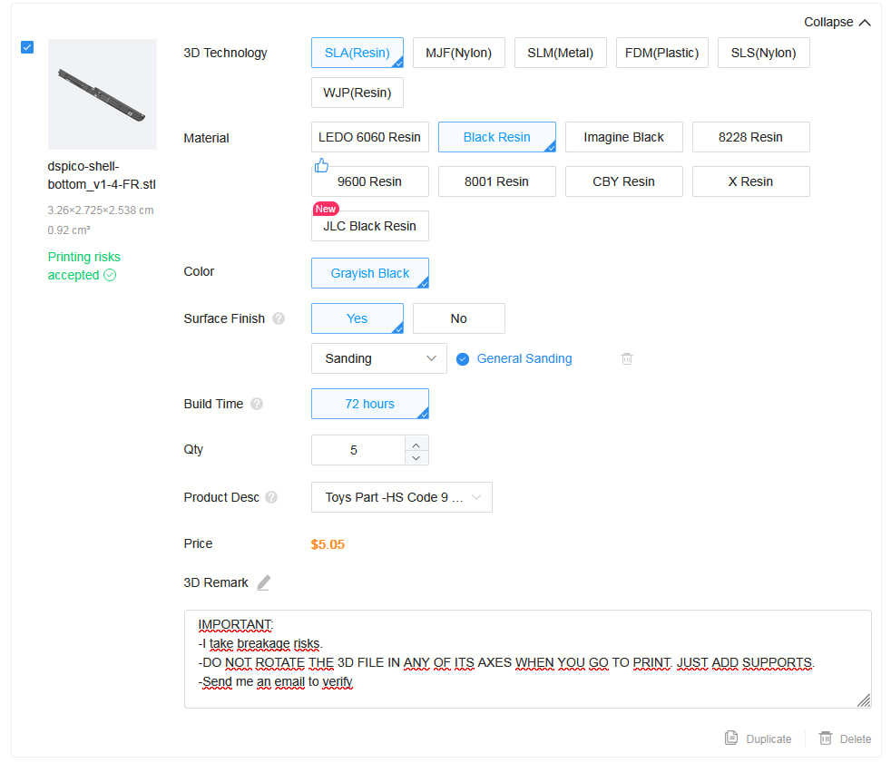
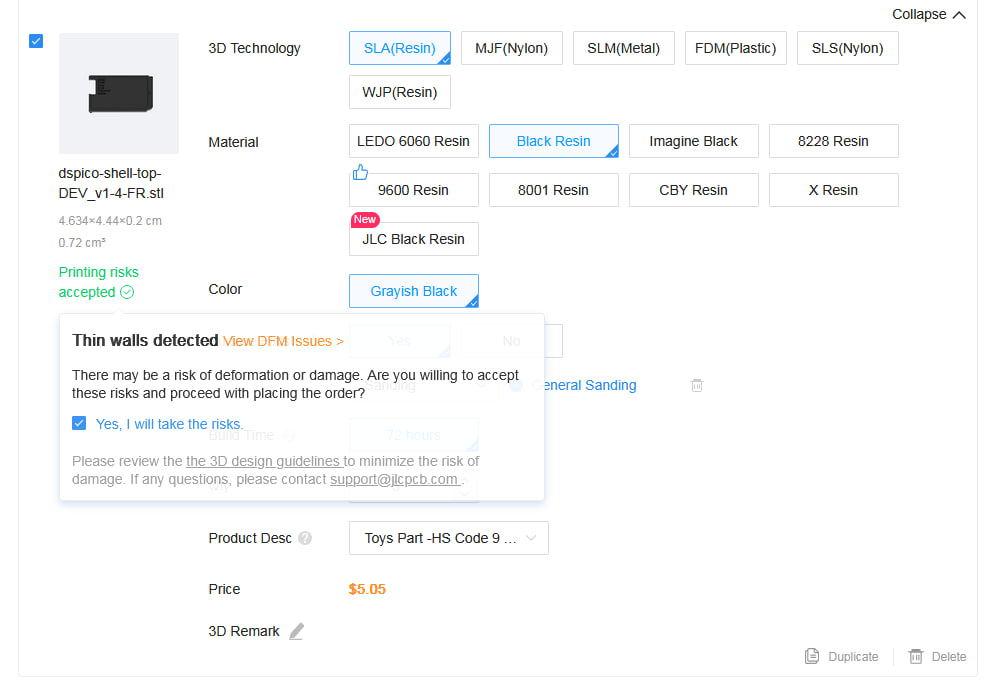
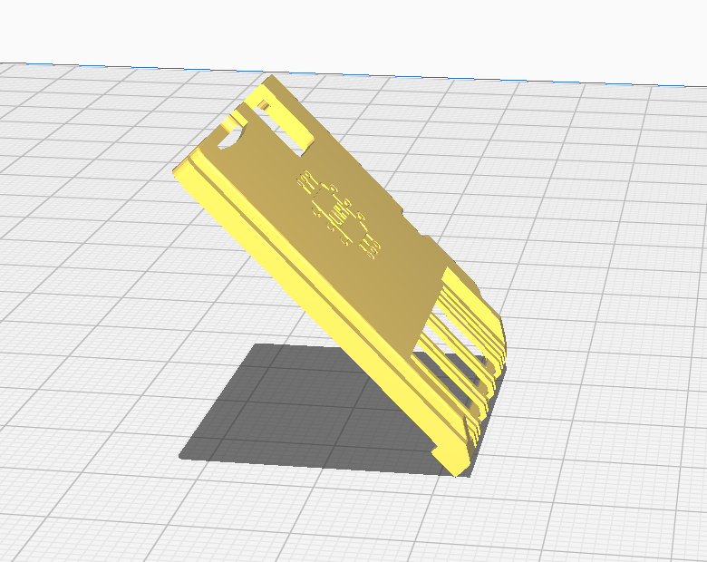
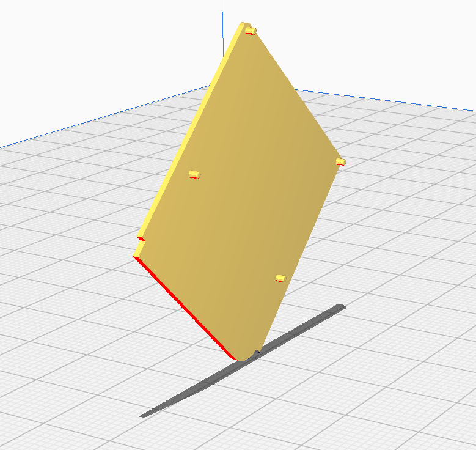
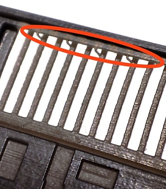

# DSpico shell
## ℹ Introduction
To obtain a shell, you can print it yourself if you have an SLA printer, or you can order it online from manufacturers like PCBWAY and JLCPCB. If you order the shell from one of the mentioned services, please follow the guide in this readme.

## 📂 Included Subfolders:
- [`design-files`](design-files): Contains source design files for the shell
    - 📄 `dspico-shell.ipt`: Inventor design file of DSpico shell  
- [`3d-models`](3d-models): Contains 3D models of the shell in STL and STEP format for fabrication.
    - 📄 `dspico-shell-top_vX-Y.stl`: Printing file for the top part of the shell.
    - 📄 `dspico-shell-bottom_vX-Y.stl`: Printing file for the bottom part of the shell.
    - 📄 `dspico-shell-top_vX-Y-FR.stl`: Printing file for the top part of the shell, with forced rotation (-FR), (Please use this file when sending it to the manufacturer for the shell).
    - 📄 `dspico-shell-bottom_vX-Y-FR.stl`: Printing file for the bottom part of the shell, with forced rotation (-FR), (Please use this file when sending it to the manufacturer for the shell).
---
## 📦 Guide to get a shell

> [!WARNING]
> Please do not skip any steps otherwise the shell could go wrong.

> [!CAUTION]
> **Request both the shell's top part and bottom part in the same order with the same material** .
>
> Ordering them separately or in different materials may result in mismatched parts. This is because the manufacturer might produce them on different printers with varying tolerances, and tolerances can also differ between materials.

### JLC3DP (JLCPCB)
1. **Go to the Website of manufacturer**

    Visit [JLCPCB 3D Printing Quote](https://jlc3dp.com/3d-printing-quote).

2. **Upload shell parts**

    Upload [`dspico-shell-bottom_vX-Y-FR.stl`](3d-models/v1.4/forced-rotation-printing/dspico-shell-bottom_v1-4-FR.stl) and [`dspico-shell-top_vX-Y-FR.stl`](3d-models/v1.4/forced-rotation-printing/dspico-shell-top_v1-4-FR.stl) STL file. Wait for the system to analyze it.

4. **Select Printing Options:**

(Select the same options for both the top and bottom 3d parts)
- 3D Technology: `SLA (Resin)`.
- Material: `Black Resin` (recommended to avoid issues).
- Surface Finish: `Yes`. `Sanding``
- Qty: (number of pieces you want)
- Product Desc: `Toys Part -HS Code 9`
- 3D Remark (Very IMPORTANT):

Add the next note:
> IMPORTANT:
>
> -I take breakage risks.
>
> -DO NOT ROTATE THE 3D FILE IN ANY OF ITS AXES WHEN YOU GO TO PRINT JUST ADD SUPPORTS
>
> -Send me an email to verify

   

5. **Accept Risks**

    System will warn about thin walls, select `Yes, I will take the risks.`

8. **Review and Place Order**

    Double-check all settings and confirm your order.
   
10. 📧 **Email conformation of JLCPCB and send an answer**

    After placing your order, you will need to wait for an email from JLCPCB. (normally less than 24h)

    In this email, they will usually remind you about the risks of breakage due to the thin walls and they will ask for an image of the orientation of the parts.

    When you receive the email, reply with the following message and attach the images shown below:

> Hello,
>
> As I said in the notes, I accept the risks of deformation, breakage, etc.
>
> And as for the placement, put it as it appears in the file as of 3D file, do not rotate them when you do the placement for printing, please I attached images of 2 files:
>
> - dspico-shell-bottom:
> 
> (45º)
>
> 
>
> - dspico-shell-top:
>
> (90º)
>
> 

> [!WARNING]
> Don't forget to attach the images to the email

11. **Payment**

    After sending the email, you will need to wait for the 3D parts to be approved by the manufacturer. Once approved, you will need to make the payment.

13. **After receive the order**

    It is important that when you receive your shell order, you perform a visual inspection 🕵️‍♂️ and pay special attention to the rails on the bottom part to ensure there is no leftover plastic (due to the supports included in the printing process). If there is any, carefully remove it with a cutter.

    
---
## ⚠ Warnings
Please note that sometimes manufacturers may not follow the process correctly even when provided with instructions. Additionally, due to the tolerances of 3D printing technology, there may be slight variations in dimensions. It is recommended to use SLA technology, as it offers the smallest tolerance (+-0.2mm) and is provided by PCBWAY and JLCPCB manufacturers.

If the appropriate material is not chosen, the results can be poor. Don't go by appearance. For example, the transparent resin from JLCPCB and PCBWAY would be the worst decision you could make since the dimensions change after curing and the piece deforms easily.

So please select one of the materials recommended in the next section

## 💡 Recommendations

### Materials
 - [Comparison of 3D resin materials](https://docs.google.com/spreadsheets/d/1kmLcHB08pd6XpYTxQfuauXQA3aGOPxwUc3_S_YKbFcI/edit#gid=265174143) 

For the best results in your 3D prints, it is recommended to use one of the materials of the following list:
#### JLCPCB
- Black resin
#### PCBWAY
-  UTR Therm

### Orientation
Orientation in 3D printing is very important. 

If you do not tell the manufacturer the orientation of how to print the shell, the probability that the shell will come out wrong is high. We highly recommend that you use the stl file that is in the `forced-rotation-printing` subfolder and tell the manufacturer not to rotate the part in any axis when you go to print the part and additionally send an email sending a screenshot of the orientation that wants.

You don't know the headaches this has brought.

## ❓ FAQ
>- Can I print the shell with my FDM printer? (printer of filament)

You can print it, but the precision is not as good compared to a SLA printer. You risk it not fitting properly, and the rails are difficult to print. Most importantly, these shell rails can damage the inner pins of your DS's slot if they are not printed well and with the right precision. So, for the sake of your DS, avoid it.

>- Why I have to send a email to manufacturer about specific orientation in 3d files?

The shell has thin walls for manufacturing by most producers, but it is possible to print it without issues using a specific orientation.

Manufacturers do not thoroughly analyze the  3d parts; they simply rotate it 45º on any axis and print it as is. This often leads to deformations and breakages.

Therefore, it is very important to send the email to minimize these problems as much as possible.

>- Can I use a different material instead of the recommended one? (e.g., transparent or another color)

We recommend using the materials suggested in this guide. Otherwise, you may encounter issues such as incorrect dimensions, deformations, or parts that are too flexible.

If you have tested a different material with good results, please let us know!

Check the next spreadsheet to avoid wasting your time and money: [Comparison of 3D resin materials](https://docs.google.com/spreadsheets/d/1kmLcHB08pd6XpYTxQfuauXQA3aGOPxwUc3_S_YKbFcI/edit#gid=265174143) 

## 🛠️ Issues
 - [Findings in the DSpico shell 3D printing process with resin](https://docs.google.com/document/d/161Bof1LAfQEwKCZYXi1A_FSsFC0sCSEptYKGwLPbTv0/)
 - [Comparison of 3D resin materials](https://docs.google.com/spreadsheets/d/1kmLcHB08pd6XpYTxQfuauXQA3aGOPxwUc3_S_YKbFcI/edit#gid=265174143) 

